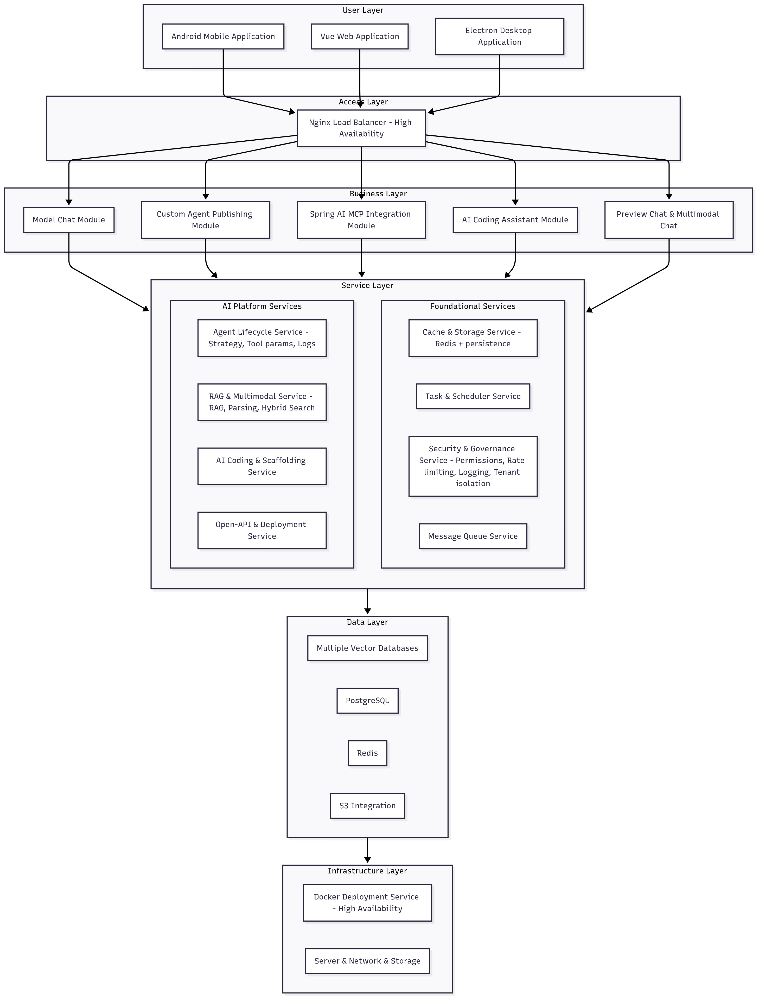

# AIMindFlow
AIMindFlow 是一款基于大语言模型的智能对话平台，支持多主流大模型交互、自定义知识库接入、多类型工具调用及个性化 Agent 构建，无需复杂开发就能快速搭建专属智能服务，为用户提供灵活可扩展的智能对话解决方案，适配学习、工作、日常探索等多种场景。

## 项目 Logo


## 系统架构图


## 项目结构

```
aimindflow
├── aimindflow-common                   # 通用模块
│   ├── aimindflow-common-bom           # 依赖版本管理
│   ├── aimindflow-common-chat          # 聊天通用功能
│   ├── aimindflow-common-core          # 核心功能
│   ├── aimindflow-common-doc           # 文档处理
│   ├── aimindflow-common-encrypt       # 加密功能
│   ├── aimindflow-common-excel         # Excel处理
│   ├── aimindflow-common-idempotent    # 幂等处理
│   ├── aimindflow-common-json          # JSON处理
│   ├── aimindflow-common-log           # 日志处理
│   ├── aimindflow-common-mail          # 邮件功能
│   ├── aimindflow-common-mybatis       # MyBatis集成
│   ├── aimindflow-common-oss           # 对象存储
│   ├── aimindflow-common-pay           # 支付功能
│   ├── aimindflow-common-ratelimiter   # 限流功能
│   ├── aimindflow-common-redis         # Redis集成
│   ├── aimindflow-common-satoken       # 认证授权
│   ├── aimindflow-common-security      # 安全功能
│   ├── aimindflow-common-sensitive     # 敏感数据处理
│   ├── aimindflow-common-sms           # 短信功能
│   ├── aimindflow-common-tenant        # 多租户功能
│   ├── aimindflow-common-translation   # 翻译功能
│   └── aimindflow-common-web           # Web功能
├── aimindflow-extend                   # 扩展模块
│   ├── aimindflow-ai-copilot           # AI助手功能
│   └── aimindflow-mcp-server           # MCP服务
├── aimindflow-modules                  # 业务模块
│   ├── aimindflow-chat                 # 聊天业务
│   ├── aimindflow-generator            # 代码生成
│   └── aimindflow-system               # 系统管理
└── aimindflow-modules-api              # 接口模块
    ├── aimindflow-chat-api             # 聊天接口
    ├── aimindflow-knowledge-api        # 知识库接口
    └── aimindflow-system-api           # 系统接口
```

## 模块说明

### aimindflow-common 通用模块
通用模块包含了系统所需的各种基础功能，如核心工具类、安全认证、数据处理等，为其他模块提供基础支持。

### aimindflow-modules 业务模块
业务模块包含了系统的主要功能实现，如聊天功能、代码生成、系统管理等核心业务逻辑。

### aimindflow-modules-api 接口模块
接口模块定义了系统对外提供的API接口，包括聊天接口、知识库接口和系统接口等。

### aimindflow-extend 扩展模块
扩展模块提供了系统的扩展功能，如AI助手、MCP服务等增强功能。